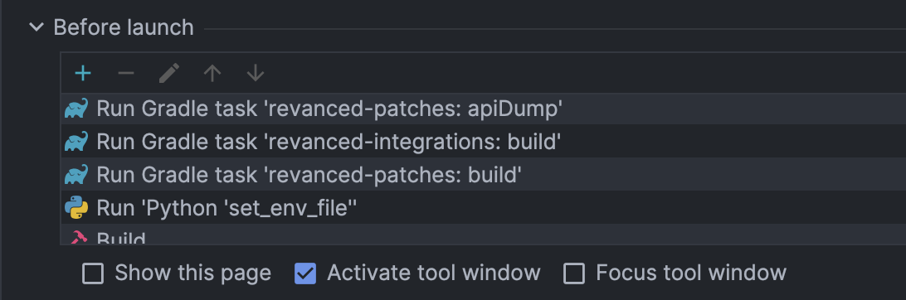

# Setup Intellij IDEA for Android Development

This guide will help you set up IntelliJ IDEA for patches development. ReVanced provides a good documentation on how to set up IntelliJ IDEA for Android development, which you can find [here](https://github.com/ReVanced/revanced-documentation/blob/main/docs/revanced-development/1_setup.md). This guide will focus more on some changes that i made to the original guide, and some additional tips that can help you in your development process.

## Prerequisites

Before you start, make sure you have the following installed:
- [IntelliJ IDEA](https://www.jetbrains.com/idea/download/)
- [Java 17](https://www.oracle.com/java/technologies/javase/jdk17-archive-downloads.html)
- [Android SDK](https://developer.android.com/studio)
- [Git](https://git-scm.com/)
- [Gradle](https://gradle.org/)

## Additional Run Configurations

After you have set up your project, i've created some run configurations that can help you in your development process. First of all you need to create a new run configuration by clicking on the dropdown menu next to the run button and selecting "Edit Configurations...". Then click on the "+" button and select "Python". You can name it whatever you want, but i suggest you to name it "Set Env" for the build preparation tasks. 
- **Script Path**: Select the `set_env_file.py` script from the root of the CLI project. This file can be found [here](../scripts/set_env_file.py).
- **Working Directory**: Select the root of the CLI project.
- **Program Arguments**: 
    ```bash
    -o ./build.env /path/to/project/owner/revanced-patches/build/libs /path/to/project/owner/revanced-integrations/app/build/outputs/apk/release
    ```

The script will generate a `build.env` file that will be used when launching the patcher. This file contains the paths to the `patches` and `integrations` directories, which are required for the patcher to work correctly. This solves the problem of having to manually edit the versions of the patches every time there is a new release. Note that you need to replace `/path/to/project/owner/` with the correct path.

Now the `Build` configurations can be easily modified to use the `build.env` file. You can do this by setting up the EnvFile plugin in IntelliJ. Unfortunately, this plugin does not work on my machine, so i had to edit the `MainCommand.kt` file to use the `build.env` file. You can find the edited file here:
    
    ```kotlin
    val env = Properties().apply {
        load(File("/path/to/project/owner/revanced-cli/build.env").reader())
    }

    // replace $PATCHES_PATH with the value of the PATCHES_PATH environment variable
    args.forEachIndexed { index, arg ->
        when (arg) {
            "\$PATCHES_PATH" -> args[index] = env.getProperty("PATCHES_PATH")
            "\$INTEGRATIONS_PATH" -> args[index] = env.getProperty("INTEGRATIONS_PATH")
        }
    }

    println("INFO: Patches file: ${env.getProperty("PATCHES_PATH").split("/").last()}")
    println("INFO: Integrations file: ${env.getProperty("INTEGRATIONS_PATH").split("/").last()}")
    ```

This will allow you to easily switch between different versions of the patches and integrations without having to manually edit the configurations every time. Note that, if the plugin does not work on your machine, you'll need to edit the Build configurations by changing the `Program Arguments` like this:

    ```bash
    patch -w --out=youtube-patched.apk -b $PATCHES_PATH --options generated-options.json -m $INTEGRATIONS_PATH youtube.apk -d emulator-5554 -i "Alternative t...
    ```

This is my configuration for the `Build` run configuration flow.
